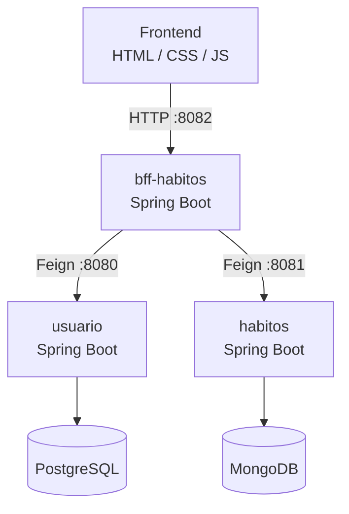

# .github
# Rastreador de Habitos

Projeto de portfólio desenvolvido para praticar arquitetura de microsserviços com Java e Spring Boot. O sistema permite que usuários criem hábitos, registrem check-ins diários e acompanhem sequências de dias consecutivos.

## Arquitetura



O frontend se comunica exclusivamente com o BFF. O BFF encaminha cada requisição ao microsserviço correspondente via OpenFeign. Nenhum microsserviço fica exposto diretamente ao frontend.

## Repositorios

| Repositorio | Responsabilidade | Porta | Banco |
|-------------|-----------------|-------|-------|
| [usuario](https://github.com/rastreador-habitos/usuario) | Cadastro, autenticacao e gestao de contas | 8080 | PostgreSQL |
| [habitos](https://github.com/rastreador-habitos/habitos) | Habitos, check-ins e calculo de streaks | 8081 | MongoDB |
| [bff-habitos](https://github.com/rastreador-habitos/bff-habitos) | Ponto de entrada unico para o frontend | 8082 | - |
| [frontend](https://github.com/rastreador-habitos/frontend) | Interface web | 80 | - |

## Stack

- Java 21
- Spring Boot
- Spring Security + JWT
- OpenFeign
- PostgreSQL
- MongoDB
- MapStruct
- JUnit 5 + Mockito
- Docker e Docker Compose
- Nginx

## Como executar

Requer Docker e Docker Compose instalados.

```bash
docker compose up --build
```

Apos todos os containers subirem, a aplicacao estara disponivel em `http://localhost`.

A API do BFF fica acessivel em `http://localhost:8082`.